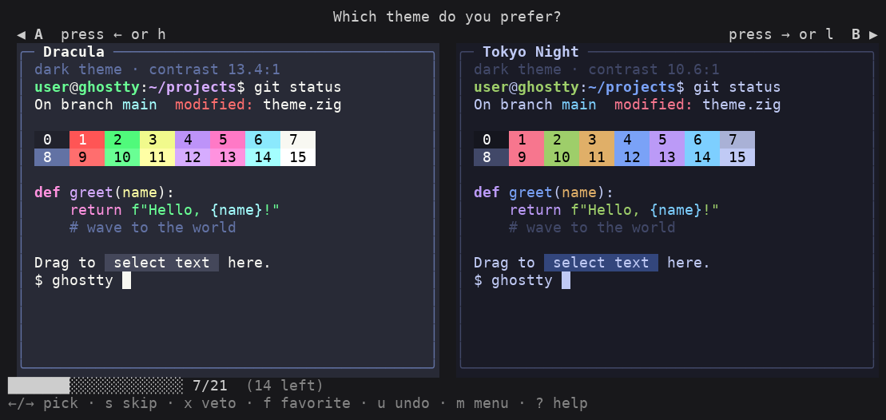
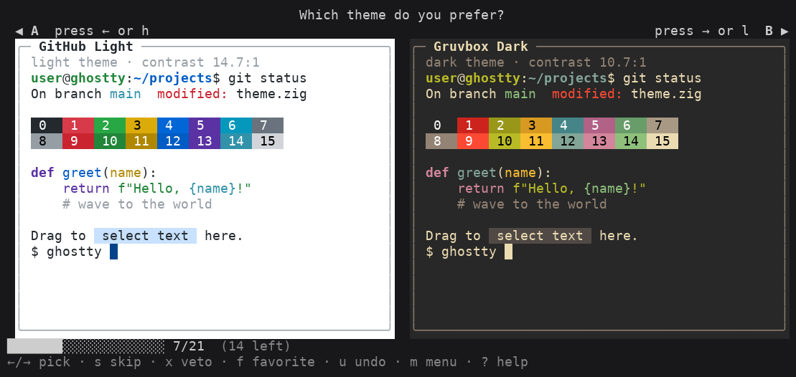

# ghostty-theme-picker

Ghostty ships with hundreds of color themes, but its built-in picker only shows
you **one at a time**. Choosing a favorite by scrolling through a long list is
slow and you can never really compare two side by side.

`ghostty-theme-picker` turns theme selection into a **side-by-side tournament**.
It shows you two themes at once — rendered as faithful mini-terminals in their
real 24-bit colors — and you pick the better one. Repeat across the matchups and
it produces a **ranked list**. Then it can write your chosen theme straight into
your Ghostty config.



It also works with light themes:



## Highlights

- **True side-by-side previews.** Each theme is drawn as a realistic terminal
  window (shell prompt, syntax-highlighted code, the full 16-color ANSI bar, a
  text selection sample and a block cursor) using the theme's exact colors —
  24-bit when your terminal supports it, with an automatic 256-color fallback.
- **Full round-robin.** Every pair of non-excluded themes is presented exactly
  once. Progress is saved continuously, so you can stop and resume anytime.
- **Veto bad themes fast.** Press `x` to remove a theme you'd never use; it
  drops out of *all* its remaining matchups, shrinking the tournament.
- **Property filters.** Prune the pool up front: exclude light themes, exclude
  dark themes, or require a minimum text/background contrast ratio.
- **Favorites & finals.** Star themes as you go, then run a decisive **finals**
  round-robin among just your favorites.
- **Ranked results.** Standings are computed with a Copeland-style win count
  (ordered by win rate so partial progress still makes sense).
- **Apply to Ghostty.** Set the winner as your Ghostty theme with one keystroke;
  the previous config is backed up first.
- **Start from a subset.** Begin from all installed themes, or from a curated
  list in a config file.
- **Zero dependencies.** Pure Python standard library, Python 3.11+.

## Install

```bash
# from a clone of this repo
pip install .

# or run without installing
python -m ghostty_theme_picker --help
```

This installs a `ghostty-theme-picker` command.

## Quick start

```bash
# Compare every installed Ghostty theme, two at a time:
ghostty-theme-picker compare

# Try it against the bundled sample themes (no Ghostty needed):
ghostty-theme-picker compare --themes-dir ./sample-themes
```

### Keys while comparing

| Key | Action |
| --- | --- |
| `←` / `h` | Left theme is better |
| `→` / `l` | Right theme is better |
| `s` / `space` | Skip this pair for now |
| `x` | Veto a theme (then pick a side) — drops all its remaining matchups |
| `f` | Favorite a theme (then pick a side) — candidate for the finals |
| `u` | Undo the last action |
| `m` / `Esc` | Open the menu (ranking, finals, filters, apply, save, quit) |
| `?` | Help |
| `Ctrl-C` | Quit (everything is saved as you go) |

From the menu you can view the live **ranking**, run the **finals** among your
favorites, adjust **filters**, or **apply** a theme to your Ghostty config.

## Other commands

```bash
# Print the current ranking (non-interactive):
ghostty-theme-picker rank

# List discovered themes, optionally with light/dark + contrast:
ghostty-theme-picker list-themes --details

# Print a single theme preview to stdout:
ghostty-theme-picker preview "Tokyo Night"

# Set a theme in your Ghostty config (defaults to the top-ranked theme):
ghostty-theme-picker apply "Tokyo Night"
ghostty-theme-picker apply            # applies your #1 ranked / selected theme

# Show resolved paths and counts:
ghostty-theme-picker info
```

### Starting from a subset

```bash
# Restrict the tournament to a comma-separated list:
ghostty-theme-picker compare --pool "Dracula,Nord,Tokyo Night,Gruvbox Dark"

# ...or from a file with one theme name per line:
ghostty-theme-picker compare --pool-file my-shortlist.txt
```

You can also point `--config` at any saved session file; its `pool` and
`excluded` lists define the starting set.

## Where things live

- **Picker state / results:** `$XDG_CONFIG_HOME/ghostty-theme-picker/picker.toml`
  (override with `--config`). This is the deliverable: it stores the ranked
  list, the themes you excluded, your favorites, the filters, the recorded
  comparisons (so sessions resume), and your selected theme.
- **Ghostty config:** auto-detected at `$XDG_CONFIG_HOME/ghostty/config`
  (and the macOS Application Support location). Override with
  `--ghostty-config`.
- **Theme files:** auto-detected from the usual Ghostty resource directories.
  If yours live somewhere unusual, set `--themes-dir DIR` or the
  `GHOSTTY_THEMES_DIR` environment variable.

### Example `picker.toml`

```toml
version = 1
selected = "Tokyo Night"
excluded = ["Faded Mono"]
favorites = ["Dracula", "Tokyo Night"]
ranking = ["Tokyo Night", "Dracula", "Nord", "Gruvbox Dark"]

[filters]
exclude_light = true
exclude_dark = false
min_contrast = 4.5

[[comparison]]
winner = "Tokyo Night"
loser = "Nord"
```

## How ranking works

Each decision is recorded as a `(winner, loser)` pair. Themes are ordered by
**win rate**, then total wins, then fewest losses. For a *completed*
round-robin (where every theme plays the same number of games) this is exactly
a Copeland win count; mid-tournament, win rate keeps partial standings
sensible. Vetoing a theme removes it — and all comparisons involving it — from
the ranking entirely.

The total number of matchups is `n·(n−1)/2`, which grows quickly: ~45,000 for
300 themes. Vetoing themes you'd never use and applying property filters are
the fastest ways to get to a finishable size; the progress bar shows how many
matchups remain and how many each veto would remove.

## Development

```bash
# Run the test suite (standard library unittest, no extra deps):
python -m unittest discover -s tests -t .
```

## License

MIT — see [LICENSE](LICENSE).
